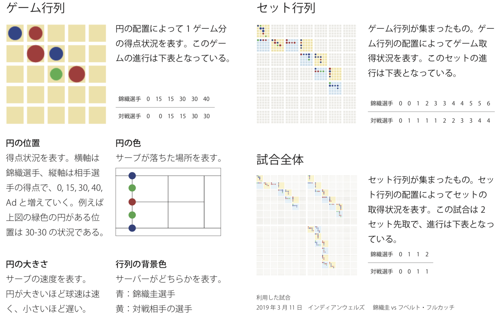

# Visual K

- https://visual-k.herokuapp.com

## アプリケーションの説明
サーブの分析や練習をしたいテニスプレイヤー向けの、試合の進行とサーブの特徴を可視化するアプリケーション。 試合の進行全体を把握するために行列表現を用いた。また、サーブの特徴を分析するために「落下地点」「球速」の二つのデータに 着目し可視化を行った。今回利用したデータは2019 年の錦織圭選手の試合のものである。

## ファイル構成のメモ
- index.php : トップページ
- vis.php : 可視化プログラム、可視化の本質的なコードはJSで記述
- view_csv.php : csv形式のデータを表示する
- data/ : データの保存場所
- archive/ : データをアップロードするなどの機能など。heroku上では使えない。